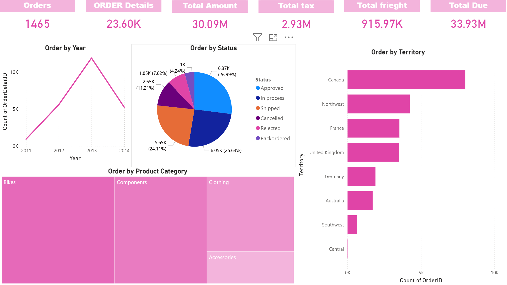

# 📊 Sales Dashboard Analysis – Power BI

## 📌 Project Overview

This project is my third Power BI practice lab.
The objective of this lab was to work with an Excel sales dataset, transform and prepare the data, create DAX measures, and build an interactive dashboard to analyze sales performance, orders, territories, statuses, and product categories.

The dataset was imported from Excel, cleaned and transformed in Power BI, then used to create a dashboard with KPI cards and charts for analysis.

---

## 🗂 Dataset

The dataset used in this project is:

**Sales.xlsx**

The dataset contains sales-related information such as:
- Orders
- Order Details
- Total Amount
- Tax
- Freight
- Total Due
- Order Status
- Territory
- Product Category
- Year

---

## ⚙️ Data Preparation

Data preparation was performed using **Power Query in Power BI**.

The following steps were applied:

1. Imported the Excel dataset into Power BI.
2. Reviewed the tables and selected the required data.
3. Cleaned and transformed the dataset in Power Query.
4. Checked column types and ensured fields were correctly formatted.
5. Loaded the cleaned data into the Power BI model.

After these steps, the dataset was ready for analysis and dashboard creation.

---

## 📊 Dashboard

An interactive **Power BI dashboard** was created to analyze sales data.

The dashboard includes the following KPI cards:

- **Orders**
- **Order Details**
- **Total Amount**
- **Total Tax**
- **Total Freight**
- **Total Due**

---

## 📈 Visualizations

The dashboard contains several visualizations:

### Order by Year
A line chart showing the trend of orders across different years.

### Order by Status
A pie chart showing the distribution of orders by status, such as:
- Approved
- In Process
- Shipped
- Cancelled
- Rejected
- Backordered

### Order by Territory
A bar chart showing the number of orders by territory.

### Order by Product Category
A treemap showing the contribution of each product category, such as:
- Bikes
- Components
- Clothing
- Accessories

---

## 🛠 Skills Practiced

Through this lab, I practiced:

- Importing and transforming Excel data
- Data cleaning using Power Query
- Creating DAX measures
- Creating a separate table for measures
- Organizing measures using display folders
- Reusing measures in multiple visuals
- Editing and formatting card visuals
- Applying conditional formatting
- Formatting numbers in cards
- Validating dashboard values by comparing them with the Excel source
- Understanding the fundamentals of choosing the right chart

---

## 🛠 Tools Used

- Power BI Desktop
- Power Query
- DAX
- Excel

---

## 📷 Dashboard Preview

## 📚 Key Learnings

Through this project I learned:

- How to transform Excel data in Power BI
- How to create and manage measures
- How to build a dedicated measures table
- How to organize measures into folders
- How to customize card visuals
- How to apply conditional formatting
- How to verify report accuracy using the original Excel file
- How to choose suitable charts based on the type of analysis
- How to display numbers as full values for exact checking and validation
- How to use rounded formats such as K and M for better dashboard readability

---

## 🎯 Key Insights

Some insights from the dashboard:

- The highest order activity appears in **2013**
- **Approved** and **In Process** represent the largest share of order statuses
- **Canada** has the highest number of orders by territory
- **Bikes** is the leading product category

## 👤 Author

**Salah Eddine**
Power BI / Data Analytics Practice Projects